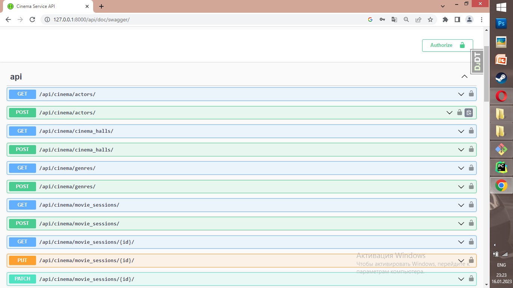
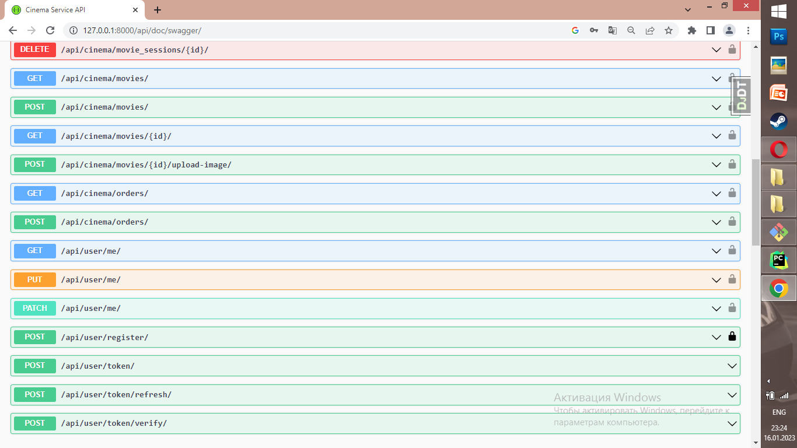

# Cinema-django-rest-api

REST-API for cinema-management. Written by DRF.

## Installing 
Install PostgresSQL and create db

```
git clone https://github.com/Polyakiv-Andrey/py-dockerize-cinema.git
cd Cinema-django-rest-api
python -m venv venv
source venv/bin/activate
pip install -r requirements.txt
set DB_HOST=<your db hostname>
set DB_NAME=<your db name>
set DB_USER=<your db username>
set DB_PASS=<your db user password>
set DJANGO_SECRET_KEY=<your secret key>
python manage.py migrate
python manage.py runserver
```
## Run with docker

Docker should be installed
```
docker-compose build
docker-compose up
```
## Access
* create user via /api/user/register/
* get access token via /api/user/token/

## Features
* JWT authenticated
* Admin panel /admin/
* Documentation is located at api/doc/swagger/
* Managing orders and tickets
* Creating movies with genres, actors
* Creating cinema halls
* Adding movie sessions
* Filtering movies and movies sessions

## Swagger


